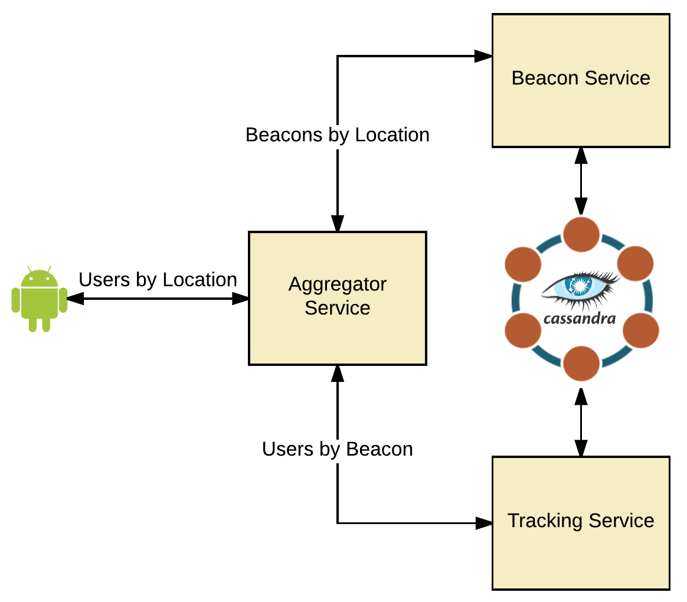

# Composing Microservices with Docker & SBT

## Setup
The named volumes must exist before starting the services
```bash
# Create named volumes for Cassandra
docker volume create --name markglh-cassandra-node1-data
docker volume create --name markglh-cassandra-node2-data
docker volume create --name markglh-cassandra-node3-data
```


## Running the services
From the root directory:
```bash
./build-all.sh
docker-compose up
```

The aggregation service is exposed on the following url:

`http://localhost:9000/aggregator/locations/<locationId>/<epochTime>`
e.g: <http://localhost:9000/aggregator/locations/6bcb1c95-a283-468a-a7ee-ce7f21168b71/1473156000>

Individual services are as follows:

`http://localhost:9000/beacons/locations/<locationdId>`

`http://localhost:9000/tracking/beacons/<beaconId>/<epochTime>`

`Nginx` will route to the appropriate container based on the path

The Cassandra cluster has been initialised with data automatically, as follows:
##### Beacons
```
06ea8543-c6f2-4b32-96e2-89a88338403b, 3f60d4de-99d3-4652-bb42-db69ea0d2e6d, 44700c71-8d3b-42f8-a9d0-e5d2064d355b
```

##### Locations
```
6bcb1c95-a283-468a-a7ee-ce7f21168b71, 54acaf0a-bd29-4b40-b36e-bc63314ab5b4, 804ece81-86e0-4887-abb0-41b8aec08dd8, ea47b13b-dc37-4523-830b-922bbb0dabc3, 0b748d95-ad9e-4bd3-89ce-1f5fab50e81e
```

All users were `logged` at `2016-09-06 10:00:00+0000` (Epoch: `1473156000`) for simplicity.

## Cleanup
```bash
# Stop & Clean up old containers and Volumes
docker stop $(docker ps -a -q)
docker rm $(docker ps -a -q)
docker volume rm markglh-cassandra-node1-data
docker volume rm markglh-cassandra-node2-data
docker volume rm markglh-cassandra-node3-data
```

## Blog
All the source code and a markdown version of this blog is available on my github repo.

The code is available here: (https://github.com/markglh/composing-microservices-with-sbt-docker)

### Introduction
A client that I’m working with recently joined the *Docker revolution*. One of the great things about Docker is how it allows you to easily replicate the production environment both on your local machine and within a CI environment, allowing you to run comprehensive integration tests both locally and as part of CI/CD.

One major drawback with a Microservice based architecture is the difficulty setting up and managing your environment. We no longer simply deploy our single Monolith into an app container and point that at (god forbid) Oracle. Rather we have 5-5000 individual (perhaps clustered) services which all need to communicate with each other, either directly or via an event stream. This is not trivial.

In production you now have a number of choices for managing these environments; Mesos DC/OS, Kubernetes, Amazon ECS, Docker Swarm….. the list is getting bigger all the time. At Cake our preferred solution is Mesos DC/OS (see Ani’s blog: http://www.cakesolutions.net/teamblogs/smack-stack-on-dcos), however locally we can replicate this setup using docker-compose to define and manage services.

In this blog series I will discuss using `docker-compose` to manage several Microservices and their dependencies, creating a reproducible environment that can be used for spawning any number of services with a single command.

This first part is all about *Dockerizing* your services from zero, we’ll then jump into defining the environment using Docker Compose in part 2.

### Getting setup
First you’ll need to install docker on your machine. I’d recommend familiarising yourself with Docker first (https://docs.docker.com/engine/understanding-docker/), then installing the appropriate version for your platform (https://docs.docker.com/engine/installation/#installation).

### Our demo app
Let’s pretend for a second we have a huge indoor conference venue, and we want to track where each of our attendees go within it - perhaps so we can do some super cool machine learning around it? Maybe we can improve future events automatically? Who cares?

Regardless, we’re ploughing ahead and will implement this using a naive microservices approach. We're holding the event in an old bunker and so don’t have any gps signal within the venue. Therefore we’re going to use Bluetooth Beacons to track everyone, in conjunction with our slick cross platform mobile app. We already have two services, one to find `beacons by location`, and one to track `users by beacon` (and time). However we want to find all users at a given location at a given time, we’ll do this by fronting the services with an `aggregator` which makes this easier.

So, we have 3 simple (tightly coupled) Scala services which communicate via REST.

- `Beacon Service`, which is responsible for information relating to Bluetooth Beacons (such as the location).
- `Tracking Service`, which is responsible for tracking the location of our users - we’ll call this each time a user connects to a beacon.
- `Aggregation Service` which acts as a front for the two services, providing a way for clients to retrieve data without multiple simultaneous WAN calls.

**Note**: Whilst the architecture is somewhat questionable, it’ll serve us just fine for this demonstration.



To reiterate, what we’re aiming to do is find everyone that was at a specific location at a specific time. We’ll ignore how that data came to exist and simply query it as follows:

 1. The client will call the `Aggregator service` with a location and time.
 2. The `Aggregator service` will call the `Beacon service` to find the Id of the Beacon at that location.
 3. The `Aggregator service` will call the `Tracking service` to find all attendees connected to the Beacon at the specified time.

The services are implemented using `Scala`, `http4s` for the REST API & `Quill` for Cassandra integration. The implementation details aren’t important however (I used this as an excuse to try the aforementioned frameworks).
For this tutorial we’ll make the assumption that the three services have already been implemented and walk through building the Docker images and defining the docker-compose YAML.

### Building the images
Before we can start `composing` our services, we need to create and build the docker images. We’ll do this using [`sbt-docker`](https://github.com/marcuslonnberg/sbt-docker). I would also recommend familiarising yourself with the official [Dockerfile reference](https://docs.docker.com/engine/reference/builder/).

#### sbt-assembly
First though, we need a `fat jar` which can be executed within our container. For this we’re using [`sbt-assembly`](https://github.com/sbt/sbt-assembly). So let’s get started by importing the required sbt plugins and preparing our `plugins.sbt` and `build.sbt`.
```scala
resolvers += "Typesafe repository" at "https://repo.typesafe.com/typesafe/releases/"

addSbtPlugin("com.eed3si9n" % "sbt-assembly" % "0.14.3")

addSbtPlugin("se.marcuslonnberg" % "sbt-docker" % "1.4.0")
```
```scala
mainClass in assembly := Some("com.markglh.blog.Bootstrap")

// Resolve duplicates for Sbt Assembly
assemblyMergeStrategy in assembly := {
  case PathList(xs@_*) if xs.last == "io.netty.versions.properties" => MergeStrategy.rename
  case other => (assemblyMergeStrategy in assembly).value(other)
}

// publish to artifacts directory
publishArtifact in(Compile, packageDoc) := false

publishTo := Some(Resolver.file("file", new File("artifacts")))

cleanFiles <+= baseDirectory { base => base / "artifacts" }
```

With the above, we've added the appropriate plugins and then configured our `build.sbt`. This now creates a `fat jar` (by running `sbt assembly`). 

#### sbt-docker
We can now get to work defining our Docker image.

```scala
enablePlugins(sbtdocker.DockerPlugin)

dockerfile in docker := {
  val baseDir = baseDirectory.value
  val artifact: File = assembly.value

  val imageAppBaseDir = "/app"
  val artifactTargetPath = s"$imageAppBaseDir/${artifact.name}"
  val artifactTargetPath_ln = s"$imageAppBaseDir/${name.value}.jar"

  //Define the resources which includes the entrypoint script
  val dockerResourcesDir = baseDir / "docker-resources"
  val dockerResourcesTargetPath = s"$imageAppBaseDir/"

  val appConfTarget = s"$imageAppBaseDir/conf/application" //boot-configuration.conf goes here
  val logConfTarget = s"$imageAppBaseDir/conf/logging" //logback.xml

...
}
```

Above we enable the plugin and define the source and target paths of files to be added to our image. Note that the source paths are relative to our project directory, whereas the target paths are absolute paths *within our image*.

```scala
...
new Dockerfile {
    from("openjdk:8-jre")
    maintainer("markglh")
    expose(80, 8080)
    env("APP_BASE", s"$imageAppBaseDir")
    env("APP_CONF", s"$appConfTarget")
    env("LOG_CONF", s"$logConfTarget")
    copy(artifact, artifactTargetPath)
    copy(dockerResourcesDir, dockerResourcesTargetPath)
    copy(baseDir / "src" / "main" / "resources" / "logback.xml", logConfTarget) //Copy the default logback.xml
    //Symlink the service jar to a non version specific name
    run("ln", "-sf", s"$artifactTargetPath", s"$artifactTargetPath_ln")
    entryPoint(s"${dockerResourcesTargetPath}docker-entrypoint.sh")
  }
...
```

So what’s going on here?

- We extend the [official openjdk docker image](https://hub.docker.com/_/openjdk/)
- Ports are exposed for our service.
- Environment variables are defined for configuration paths, we can then access these at runtime and in the `entrypoint`.
- We copy the resources, configs and the jar to our image. The `sbt docker` task depends upon the `assembly` task, so this jar has been automatically created for us by this point.
- We define a `symlink` to our versioned jar.
- We define an entrypoint which describes what to do when the container (**a running image**) starts, more on that soon.

We’re almost done with our `build.sbt`, just one more thing...

```scala
imageNames in docker := Seq(
  ImageName(
    //namespace = Some(organization.value),
    repository = name.value,
    // We parse the IMAGE_TAG env var which allows us to override the tag at build time
    tag = Some(sys.props.getOrElse("IMAGE_TAG", default = version.value))
  )
)
```

By default `sbt-docker` will tag the image with the `version` defined in our `build.sbt`. Sometimes though, this isn’t what we want - in our CI environment for example we may want to assign custom tags immediately. To allow this we use an `IMAGE_TAG` argument which will be used instead if present. You would use this as follows:
`sbt clean -DIMAGE_TAG=someTag docker`

That concludes our `build.sbt`, but there are a few things we’re missing...

#### docker-resources
Our image requires a few resources external to our service, we’ve created the `docker-resources` directory at the root of each project for this purpose. Let’s walk through these in detail.

- [`scripts/wait-for-it.sh`](https://github.com/vishnubob/wait-for-it) - This is gives us a reliable way to wait for resources to become available on specific ports. We use this to control the startup order of our services; more specifically we're waiting for Cassandra to become available. Whilst Docker compose allows us to control the startup order of containers, it doesn’t wait until the application within the container has completely started - see:  (https://docs.docker.com/compose/startup-order/). At least not yet anyway:  (https://github.com/docker/compose/issues/374). One thing worth noting here, a reliable service should be able to automatically retry and restart should a connection be unavailable, rather than simply dying. This is essential for a resilient microservice (which these are not!).
- `docker-entrypoint.sh` - This file deserves it’s own section...

#### Docker Entrypoint
Our Docker image defines an [`entrypoint`](https://docs.docker.com/engine/reference/builder/#entrypoint) which handles the startup procedure. For us, this means invoking the `docker-entrypoint.sh` script, let’s cover this in more detail. 

```bash
#!/bin/bash

set -e
set -x

/app/scripts/wait-for-it.sh -t 0 cassandra-node1:9042 -- echo "CASSANDRA Node1 started"
/app/scripts/wait-for-it.sh -t 0 cassandra-node2:9042 -- echo "CASSANDRA Node2 started"
/app/scripts/wait-for-it.sh -t 0 cassandra-node3:9042 -- echo "CASSANDRA Node3 started"

APP_OPTS="-d64 \
          -server \
          -XX:MaxGCPauseMillis=500 \
          -XX:+UseStringDeduplication \
          -Xmx1024m \
          -XX:+UseG1GC \
          -XX:ConcGCThreads=4 -XX:ParallelGCThreads=4 \
          -Dcom.sun.management.jmxremote.port=9999 -Dcom.sun.management.jmxremote.ssl=false \
          -Dcom.sun.management.jmxremote.authenticate=false \
          -Dcom.sun.management.jmxremote.local.only=false \
          -Dcom.sun.management.jmxremote.rmi.port=9999 \
          -Dcom.sun.management.jmxremote=true \
          -Dlogger.url=file:///${LOG_CONF}/logback.xml
         "

java ${APP_OPTS} -cp ${APP_BASE}/conf -jar ${APP_BASE}/tracking-service.jar
```

As you can see, we first block startup until all Cassandra nodes are available. Obviously it’s not good practice to hard code this behaviour into your image, it’s much better to wait for one node to become available and handle any retries or restarts properly within your resilient service. In a future blog, we’ll walk through how to properly initialise and manage Cassandra schemas from a docker container, using [pillar](https://github.com/Galeria-Kaufhof/pillar). Having this sort of delayed startup becomes much more useful in that scenario.

Finally we set our jvm arguments and start the service, notice that we make use of the `LOG_CONF` and `APP_BASE` environment variables which we defined in our `build.sbt` image. We have hard-coded the various GC properties - generally these are targeted at a known production environment. However it wouldn’t require much effort to make these configurable and instead provide them at runtime.

#### What about Cassandra?
We’re connecting to a Cassandra cluster, which will be defined later using the official Cassandra image from dockerhub (https://hub.docker.com/_/cassandra/). However we need to configure our app to connect to it, we do this in the `application.conf` of each service.
```scala
cassandra {
   keyspace = "tracking_service"
   preparedStatementCacheSize = 1000
   session.contactPoint = cassandra
   session.credentials.0 = cassandra //Username
   session.credentials.1 = cassandra //Password
   session.queryOptions.consistencyLevel = LOCAL_QUORUM
   session.withoutMetrics = true
   session.withoutJMXReporting = false
   session.maxSchemaAgreementWaitSeconds = 1
}
```

As you can see, we default to `cassandra` for the host. We’ll discuss this further when walking through the Docker compose setup in part 2.

#### Runtime Configuration
The configuration (`application.conf`) in production will almost certainly differ from what’s used when developing the services. Enabling this is quite simple.

First we define the `APP_CONF` environment variable in the `build.sbt`. We then read this at runtime when bootstrapping the application in `Bootstrap.scala`:
```scala
lazy val config = ConfigFactory
    .parseFile(new File(s"${sys.env.getOrElse("APP_CONF", ".")}/boot-configuration.conf"))
    .withFallback(ConfigFactory.load())
```

Above, we attempt to load our specific configuration file at the `APP_CONF` location, then fallback to the default if this is unavailable. Using this technique makes swapping in an environment specific configuration really simple, however it’s important that this `config` instance is used throughout the application - though this is good practice anyway. 
When we walkthrough `docker-compose` in part 2 of this tutorial, we’ll explain how to use `volumes` to provide this file to the container at runtime.

### Wrap up
That’s it! All three services are pretty much identical so there’s no need to describe the other services, we’re not re-using code between them for simplicity.

To build our images we run the following command for each service:
`sbt docker`

The `build-all.sh` script at the root level will automatically build all three services:
`./build-all.sh`

### Moving On
Today we've `dockerized` three services, built the images and defined the `entrypoints` ready to be composed.

In part 2 we'll walkthrough the following

 - Creating `docker-compose.yml`, defining each service along with appropriate dependencies
 - Defining environment specific configuration using volumes
 - Creating a Cassandra cluster and automatically initialising the various keyspaces, tables and data
 - Defining named volumes to re-use cassandra data between containers
 - Using Nginx to route requests to the appropriate service
 
In the meantime, all code (including docker-compose) can be found on my github: https://github.com/markglh/composing-microservices-with-sbt-docker.
Instructions of how to get this up and running are also documented, but will be covered in more detail in part 2.

